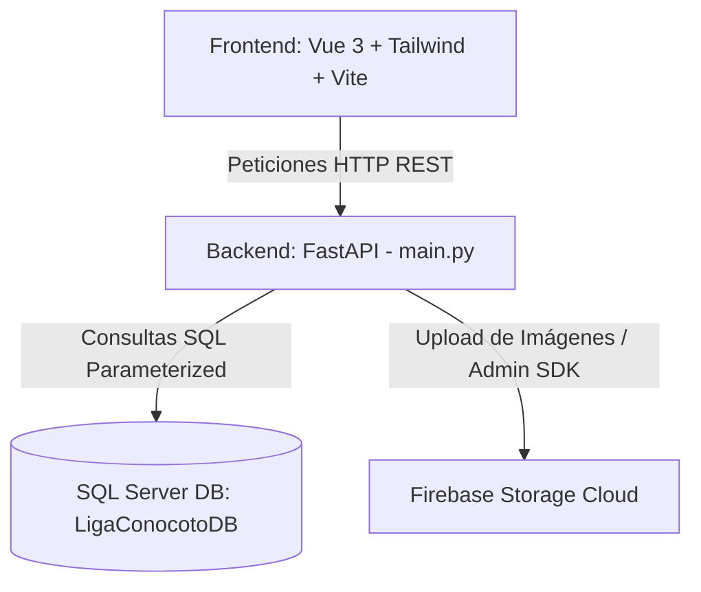

# 🏆 Liga Deportiva Barrial (LDP Conocoto)

[](https://fastapi.tiangolo.com/)
[](https://vuejs.org/)
[](https://vitejs.dev/)
[](https://www.microsoft.com/sql-server)
[](https://tailwindcss.com/)
[](https://firebase.google.com/)

Sistema web de gestión integral para ligas deportivas barriales de fútbol. Administra equipos, jugadores, árbitros, fixtures automáticos, tabla de posiciones, actas de partidos (vocalía), estadísticas, suspensiones y un módulo personalizado para jugadores ("Camerino Virtual").

---

## 📋 Tabla de Contenidos

- [Características Principales](#-características-principales)
- [Arquitectura del Sistema](#-arquitectura-del-sistema)
- [Tecnologías Utilizadas](#-tecnologías-utilizadas)
- [Estructura del Proyecto](#-estructura-del-proyecto)
- [Requisitos del Sistema](#-requisitos-del-sistema)
- [Configuración e Instalación](#-configuración-e-instalación)
  - [1. Base de Datos (SQL Server)](#1-base-de-datos-sql-server)
  - [2. Backend (FastAPI)](#2-backend-fastapi)
  - [3. Frontend (Vue 3 + Vite)](#3-frontend-vue-3--vite)
- [Endpoints Principales de la API](#-endpoints-principales-de-la-api)
- [Licencia y Notas](#-licencia-y-notas)

---

## 🔥 Características Principales

### 🛡️ 1. Gestión de Equipos
- Registro, edición y eliminación de equipos de fútbol.
- Categorización de equipos (ej. *Primera*, *Máxima*).
- Carga y actualización de escudos oficiales a través de Firebase Storage.
- Cambio de categoría individual o en masa.

### ⚽ 2. Gestión de Jugadores y Traspasos
- Registro detallado de jugadores (Nombres, Cédula, Fecha de Nacimiento, Posición, Número de Camiseta).
- Verificación automática de edad máxima y validación estricta de cédula (evita duplicidad con registros de árbitros).
- Módulo de **Traspasos de Jugadores** entre equipos durante el mercado de pases.
- Subida de fotografías de perfil de jugadores a Firebase Storage.

### 🏁 3. Ternas Arbitrales y Calificación
- Gestión de árbitros con datos personales y cédula de identidad.
- Asignación de árbitros por partido (Árbitro Central, Juez de Línea 1, Juez de Línea 2).
- Sistema de **Calificación Arbitral**: Los equipos o vocales pueden puntuar la actuación arbitral post-partido.

### 📅 4. Generación Automática de Fixtures
- Algoritmo de programación **Round-Robin (Todos contra Todos)** por categoría.
- Generación automática de partidos por fechas con asignación de vocalías.
- Control de seguridad mediante contraseña protegida (`FIXTURE_PASSWORD`) para reiniciar o limpiar el calendario completo.

### 📝 5. Control de Partidos y Vocalía (Cierre de Acta)
- Registro de marcadores en tiempo real (Goles Local vs Visitante).
- Control de incidencias por jugador: goles marcados, tarjetas amarillas y tarjetas rojas.
- Carga de fotografía del acta física firmada por el vocal para respaldo.
- Cierre formal del partido con impacto automático en las tablas de posiciones y estadísticas.

### 🚨 6. Sistema Inteligente de Suspensiones
- **Suspensión Automática por Acumulación**: 5 tarjetas amarillas equivalen automáticamente a 1 fecha de suspensión.
- **Expulsiones (Rojas)**: Manejo automático de partidos de sanción según tarjeta roja directa o doble amarilla.
- **Suspensiones Administrativas (Manuales)**: Los administradores pueden suspender manualmente a jugadores por un período específico con motivo justificado.

### 📊 7. Tablas de Posiciones y Goleadores
- Cálculo automático de la tabla de posiciones en tiempo real por categoría:
  - Partidos Jugados (PJ), Ganados (PG), Empatados (PE), Perdidos (PP).
  - Goles a Favor (GF), Goles en Contra (GC), Diferencia de Goles (DG) y Puntos totales.
- Tabla de **Goleadores** actualizada tras cada cierre de acta.

### 🚪 8. Camerino Virtual (Módulo Jugador)
- Panel privado para jugadores registrados.
- Consulta de partidos programados y resultados de su equipo.
- Confirmación de asistencia previa al partido.
- Evaluación directa del cuerpo arbitral asignado al cotejo.

---

## 🏗️ Arquitectura del Sistema

El proyecto sigue una arquitectura desacoplada Cliente-Servidor:



---

## 💻 Tecnologías Utilizadas

### Backend
- **Framework:** FastAPI (Python 3.10+)
- **Servidor ASGI:** Uvicorn
- **Base de Datos:** Microsoft SQL Server via `pyodbc`
- **Almacenamiento Cloud:** Firebase Admin SDK (`firebase-admin`)

### Frontend
- **Framework UI:** Vue 3 (Composition API / `<script setup>`)
- **Herramienta de Construcción:** Vite
- **Estilos CSS:** Tailwind CSS + Vanilla CSS
- **Enrutamiento:** Vue Router (SPA)

---

## 📁 Estructura del Proyecto

```
LigaDeportivaBarrial/
├── main.py                     # API principal FastAPI (Modelos, Endpoints y Lógica de Negocio)
├── database.py                 # Conexión pyodbc a SQL Server
├── ensure_schema.py            # Script idempotente para verificación/migración de esquemas DB
├── firebase_service.py         # Módulo de integración con Firebase Storage
├── firebase-key.json           # Credenciales de servicio Firebase (GitIgnored)
├── fixture_password.txt        # Almacenamiento local de contraseña de administración de Fixtures
├── CLAUDE.md                   # Guía de desarrollo y contexto
├── README_FIREBASE.md          # Guía detallada de integración con Firebase
├── frontend-liga-vue/          # Aplicación Frontend Vue 3
│   ├── src/
│   │   ├── components/         # Componentes (Navbar, ImageUploader, etc.)
│   │   ├── views/              # Vistas principales (AdminDashboard, JugadorDashboard, Login, etc.)
│   │   ├── router.js           # Enrutador de Vue Router
│   │   ├── style.css           # Estilos generales y utilidades de Tailwind
│   │   └── App.vue             # Componente raíz
│   ├── package.json            # Dependencias de Node
│   ├── tailwind.config.js      # Configuración de Tailwind CSS
│   └── vite.config.js          # Configuración del empaquetador Vite
```

---

## ⚙️ Requisitos del Sistema

- **Python:** 3.10 o superior.
- **Node.js:** v18.0.0 o superior.
- **Microsoft SQL Server:** Instancia activa (local o remota) con la base de datos `LigaConocotoDB`.
- **Driver ODBC:** Microsoft ODBC Driver 17 para SQL Server.
- **Cuenta Firebase:** Proyecto con Firebase Storage activo.

---

## 🚀 Configuración e Instalación

### 1. Base de Datos (SQL Server)

1. Crea la base de datos `LigaConocotoDB` en tu instancia de SQL Server.
2. Revisa y ajusta la cadena de conexión en `database.py` si es necesario:
   ```python
   SERVER = 'TU_SERVIDOR\\INSTANCIA' 
   DATABASE = 'LigaConocotoDB'
   ```
3. Ejecuta el script de verificación e inicio de tablas:
   ```bash
   python ensure_schema.py
   ```

### 2. Backend (FastAPI)

1. Activa el entorno virtual de Python:
   ```bash
   # En Windows:
   .\venv\Scripts\activate
   ```
2. Instala las dependencias (si no están instaladas):
   ```bash
   pip install fastapi uvicorn pyodbc firebase-admin pydantic python-multipart
   ```
3. Coloca tu archivo `firebase-key.json` (clave de cuenta de servicio) en la raíz del proyecto.
4. Inicia el servidor de desarrollo backend:
   ```bash
   uvicorn main:app --reload
   ```
   El backend estará disponible en `http://127.0.0.1:8000`. Puedes consultar la documentación interactiva Swagger en `http://127.0.0.1:8000/docs`.

### 3. Frontend (Vue 3 + Vite)

1. Navega a la carpeta del frontend:
   ```bash
   cd frontend-liga-vue
   ```
2. Instala las dependencias de Node.js:
   ```bash
   npm install
   ```
3. Ejecuta el servidor de desarrollo:
   ```bash
   npm run dev
   ```
   El frontend estará ejecutándose en `http://localhost:5173`.

---

## 📌 Endpoints Principales de la API

| Método | Endpoint | Descripción |
| :--- | :--- | :--- |
| `POST` | `/login` | Autenticación de usuarios (Administrador / Jugador) |
| `GET` | `/equipos` | Lista de todos los equipos registrados |
| `POST` | `/equipos` | Registrar un nuevo equipo |
| `GET` | `/jugadores` | Listado general de jugadores con estado de suspensión |
| `POST` | `/jugadores` | Registrar nuevo jugador |
| `PUT` | `/jugadores/{id}/traspaso` | Transferir un jugador a otro equipo |
| `POST` | `/generar-calendario` | Generar fixture Round-Robin por categoría (Requiere clave) |
| `GET` | `/partidos` | Listar partidos programados y sus estados |
| `POST` | `/partidos/{id}/finalizar` | Registrar acta, goles, tarjetas y cerrar partido |
| `GET` | `/estadisticas/posiciones/{categoria}` | Tabla de posiciones calculada por categoría |
| `GET` | `/goleadores/{categoria}` | Tabla de máximos goleadores por categoría |
| `POST` | `/upload-image` | Subida de imágenes a Firebase Storage |
| `POST` | `/jugador/asistencia` | Registrar asistencia en el Camerino Virtual |
| `POST` | `/jugador/calificar_arbitro` | Enviar puntuación sobre el desempeño arbitral |

---

## 🛡️ Licencia y Créditos

Desarrollado para la **Liga Deportiva Barrial Conocoto (LDP Conocoto)**. Proyecto enfocado en la automatización del deporte barrial y gestión comunitaria.
